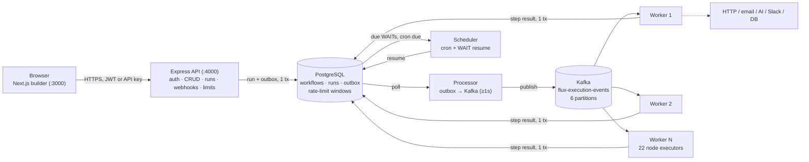

# FluX

FluX is a workflow automation platform where a workflow is an actual **graph**
— typed nodes connected by edges, with branches, loops, switches and human
approval gates — instead of the usual straight trigger→action line that most
zappers give you. You build it visually in the browser, runs execute through
a Postgres outbox → Kafka → worker pipeline, and if an integration isn't
configured the run fails with a real error instead of quietly pretending it
worked.

Out of the box you get 22 node types, 40 ready-made templates for 8 different
teams, API-key + JWT auth, a database-backed rate limiter, and a test setup
(25 unit tests, 11 live production checks, 4 E2E suites) that I keep green
before every push.

---

## How it's put together

A few decisions the whole system leans on:

**Runs are written atomically.** When you start a run, the execution row and
its outbox event go into Postgres in the same transaction. The processor
polls the outbox every second or so and publishes to `flux-execution-events`
(Kafka, 6 partitions, keyed by execution id so one run's steps stay in order).
Workers pick up events, execute exactly one node, save the step result and
write the *next* step's outbox entry in one transaction again. Nothing gets
half-written if something crashes, and runs keep going across API restarts —
I've tested this with 6 workers running at once and with the broker being
killed mid-stream.

**Branches are exclusive.** A switch or condition resolves to one handle
(`case1`, `true`, `done`…) and only follows edges carrying that label. If
nobody wired the evaluated branch, the path just ends there. This sounds
obvious; the first version of the engine fanned *all* outgoing edges out on an
unmatched default, which meant one event fired both the Slack and the email
branch. More on that below.

**Production doesn't fake anything.** In dev, unconfigured integrations
simulate their response so you can keep building. In production that same
shortcut would be a lie, so it's off: an SMTP or Slack node with no
credentials fails the run and says exactly what's missing. Placeholder JWT
secrets and the dev-user fallback are rejected at startup, not at first
request. There's an E2E suite (`e2e:fail-loud`) that fails if a mock ever
sneaks back in.

**Rate limits live in the database.** Fixed windows kept in Postgres with an
atomic upsert, so two API instances share one budget instead of each keeping
its own counters: login 30/min, forgot-password 10/min, runs 60/min per user,
webhooks 120/min per IP.

**Waits are durable.** `WAIT`/`DELAY` nodes park the run as `WAITING` and the
scheduler wakes it up when it's due. Cron triggers only fire for `ACTIVE`
workflows — a paused workflow's webhook returns 404, and so does calling a
cron-only workflow through the webhook endpoint.

## Diagrams

The overall shape:



And what one execution actually looks like:

```mermaid
sequenceDiagram
    autonumber
    actor User
    participant UI as Builder
    participant API as Express API
    participant PG as PostgreSQL
    participant PROC as Processor
    participant K as Kafka
    participant W as Worker
    participant SCH as Scheduler

    User->>UI: connect nodes, save
    UI->>API: POST /workflows
    API->>PG: workflow + nodes + edges (1 tx)

    User->>UI: activate → run  (or an external POST /webhooks/:id)
    UI->>API: POST /workflows/:id/run
    API->>PG: execution + outbox row (1 tx)

    PROC->>PG: poll outbox
    PROC->>K: publish (partition = execution id)
    K->>W: event
    W->>W: run node — unconfigured integration → FAILED, real error
    W->>PG: step result + next outbox row (1 tx)

    Note over W,SCH: WAIT/DELAY parks the run;<br/>scheduler resumes it later. Cron only fires for ACTIVE workflows.

    W->>PG: final status
    PG-->>UI: live timeline (GET /executions/:id)
```

## Tech stack

| Piece | What | Notes |
|-------|------|-------|
| Frontend | Next.js 15, React 19, React Flow, Tailwind, Zustand | builder, dashboards, 40 templates |
| API | Express 5 + TypeScript | auth, CRUD, webhook receiver, rate limits |
| Node catalog | 22 types | http, ai, code, switch, loop, email, database, slack, auth, wait, … |
| Async pipeline | transactional outbox → Kafka | 6 partitions, keyed by execution id |
| Workers | Node processes | one node per event, scale by process count |
| Scheduler | node-cron | cron triggers + WAIT/DELAY resumption |
| DB | PostgreSQL 15 + Prisma | 11 migrations; `customers`/`orders`/`tickets` fixture tables |
| Auth | NextAuth v5 → JWT, API keys | `Bearer …` or `x-flux-api-key: flux_…`, Google OAuth optional |
| Mail | Nodemailer (SMTP/Resend) | fails loud in production when unset |
| Tests | Vitest + E2E scripts | 25 tests, 11 live checks, 4 suites |
| Infra | Docker Compose | Kafka + Postgres |

## What's tested

```bash
npm run typecheck    # all five workspaces + scripts/     → 0 errors
npm run lint         # ESLint                             → 0 errors
npm test             # Vitest                             → 25/25 (4 files)
npm run templates:validate   # 10 fixture graphs, live stack
npm run templates:test       # every template, live stack
npm run e2e:distributed      # outbox → Kafka → worker journey
npm run e2e:account          # register → API key → delete cascade
npm run e2e:fail-loud        # unconfigured node must FAIL
```

On top of that there's a live harness I run against a production-mode stack
(`mocks=OFF`), 11 checks, currently **11/11**:

| Check | Result |
|-------|--------|
| unauthenticated `GET /workflows` | 401 |
| register returns a JWT | pass |
| distributed run completes | SUCCESS |
| webhook on a DRAFT workflow | 404 |
| webhook on an ACTIVE workflow | SUCCESS |
| `trigger.body.orderId` reaches the code node | `BX-42` |
| top-level `orderId` reaches the code node | `BX-42` |
| cron-only workflow via webhook | 404 |
| dashboard stats with JWT | 200 |
| run endpoint hits its 60/min budget | 429 at attempt ~61 |
| webhook hits 120/min/IP | 429 at attempt ~120 |

Rate limits, as measured: login 30/min, forgot-password 10/min, runs 60/min
per identity, webhooks 120/min per IP — all sharing Postgres counters, so
multiple API instances enforce one budget.

And the fail-loud suite produces output like this, which is the point:

```text
Slack node → FAILED
  "Slack node has no webhook URL configured. Add an incoming webhook URL in the node config."
execution status = FAILED
suite: ALL PASSED
```

## Things that bit me while building this

These are all fixed, but each one taught me something:

**1. The engine ran both branches at once.** Early on, when a switch didn't
match any rule, `determineNextEdges` followed every outgoing edge. One webhook
event ended up firing Slack *and* email for a single case. I found it by
reading old execution history and seeing two mutually exclusive nodes both
marked SUCCESS in the same run. Now the engine resolves the evaluated handle
and follows only labelled edges for it; if the branch isn't wired, the path
stops (which is also why a payload missing `value: active/inactive` only runs
trigger + switch — there's nothing wired to `default`).

**2. `req.body` destructuring caused 500s.** `const { email } = req.body`
throws when the request has no JSON body — this was live on `PUT /auth/me`,
`PUT /auth/password` and `DELETE /auth/me`. It's `req.body ?? {}` now. Caught
it by calling `DELETE /auth/me` with no body and getting a TypeError instead
of the intended 400.

**3. Mock success in production.** The simulated SMTP/Slack responses that
make dev pleasant were reachable in production too. Unconfigured integrations
now fail the run with the real reason, and `e2e:fail-loud` makes sure it stays
that way.

**4. Webhook contract.** External callers send payloads in different shapes,
so the receiver accepts both `trigger.body.orderId` and a top-level
`orderId`. The webhook route also enforces status: DRAFT → 404, cron-only
workflow → 404. The workflow id in the path doubles as the secret.

**5. Rate limits were per-process.** In-memory counters don't mean much when
there are two API instances — each had its own budget, effectively doubling
it. Moved the windows into Postgres with an atomic upsert.

**6. Password reset without SMTP** used to be a silent no-op. Now it's a 503
that tells you which SMTP variables are missing.

The longer version, phase by phase, is in
[documentation/implementation_journey.md](documentation/implementation_journey.md),
and raw outputs are in
[documentation/test_results.md](documentation/test_results.md).

## Project layout

Five npm workspaces sharing one Prisma schema:

| Directory | Role |
|-----------|------|
| `frontend/` | Next.js app — builder, dashboards, templates |
| `api/` | Express — auth, CRUD, webhooks, rate limits, graph engine |
| `processor/` | polls the outbox, publishes to Kafka |
| `worker/` | consumes Kafka, runs node executors |
| `scheduler/` | cron triggers + WAIT/DELAY resumption |
| `prisma/` | schema + 11 migrations |
| `scripts/` | E2E runners, template validation, seeding |
| `documentation/` | implementation journey, test results |

```text
FluX/
├── frontend/
│   ├── .env.example
│   └── src/
│       ├── app/              # (public) + (app) routes, API handlers
│       ├── components/       # builder, node catalog, UI
│       └── lib/              # api client, templates-data (40 graphs)
├── api/src/
│   ├── auth/                 # JWT, API keys, OAuth, passwords
│   ├── execution/            # engine, node executors, outbox, alerts
│   └── app.ts                # CORS, trust-proxy, rate limits
├── processor/src/
├── worker/src/
├── scheduler/src/
├── prisma/                   # schema.prisma + migrations/ (11)
├── scripts/                  # e2e-*, template validation, seed
├── documentation/
├── docker-compose.kafka.yml  # Kafka on :9092
├── .env.example
└── package.json              # workspaces + root scripts
```

## Running it locally

You'll need Node 20+ and Docker (for Kafka and Postgres).

```bash
# infrastructure
docker compose -f docker-compose.kafka.yml up -d
docker run -d --name synx-postgres -p 5432:5432 \
  -e POSTGRES_USER=synx -e POSTGRES_PASSWORD=synxpass \
  -e POSTGRES_DB=flux postgres:15

# env + dependencies
cp .env.example .env                # generate JWT_SECRET (command is in the file)
cp frontend/.env.example frontend/.env.local
npm install                          # postinstall runs prisma generate

# schema + demo data
npm run migrate
npm run seed:real

# start everything
npm run dev
```

Then open http://localhost:3000 and register (outside production you can also
just build things without logging in).

| Service | Address |
|---------|---------|
| Frontend | http://localhost:3000 |
| API | http://localhost:4000 |
| PostgreSQL | localhost:5432 |
| Kafka | localhost:9092 |

## Production

```bash
npm run build    # prisma generate + all five workspaces
npm start        # all five services; if one dies they all die
                 # (let the supervisor restart the whole stack)
```

Things the startup code checks for you — it won't boot half-configured:

- `NODE_ENV=production` (turns mocks and the dev-user fallback off)
- `JWT_SECRET` ≥ 32 chars and not a shipped placeholder
- `CORS_ORIGIN` with your real frontend origin(s), comma-separated
- `APP_URL` — base for password-reset links
- `AUTH_SECRET` for Auth.js sessions
- `SMTP_*` — forgot-password returns 503 and email nodes fail until these exist
- `TRUST_PROXY=1` when you're behind nginx/caddy, so limits key on real IPs
- Kafka + `EXECUTION_MODE=distributed` → processor, worker and scheduler must run

Frontend production builds read `frontend/.env.production`; plain `next dev`
keeps using `frontend/.env.local`, so localhost development and the deployed
domain don't fight over the same values.

## API surface

```
POST /auth/register | /auth/login | /auth/forgot-password | …
GET|POST /workflows          GET|PUT|DELETE /workflows/:id
POST /workflows/:id/run
GET /executions              GET /executions/:id
GET|POST /api-keys           PATCH|DELETE /api-keys/:id
POST /webhooks/:workflowId   # needs ACTIVE + webhook-type trigger; id = secret
GET /health                  GET /dashboard/*
```

Both credential types work on every authenticated endpoint — JWT
(`Authorization: Bearer …`) or API key (`x-flux-api-key: flux_ …`). A bad
credential is rejected, it never falls back to the dev user. Copy-paste
examples are in Settings → API Keys in the UI.

## Documentation

- [Implementation journey](documentation/implementation_journey.md) — what
  was built, in what order, and what went wrong along the way
- [Test results](documentation/test_results.md) — raw outputs for every
  number quoted above

---

Node.js · TypeScript · Next.js 15 · React 19 · React Flow · Tailwind ·
Zustand · Express 5 · Prisma · PostgreSQL · Kafka · node-cron · NextAuth ·
Nodemailer · Vitest
